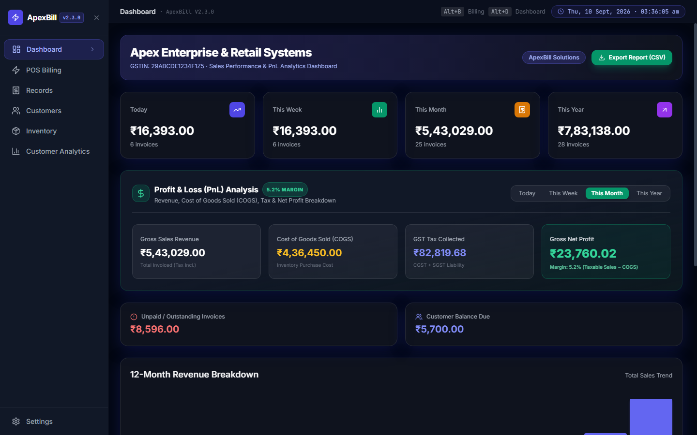
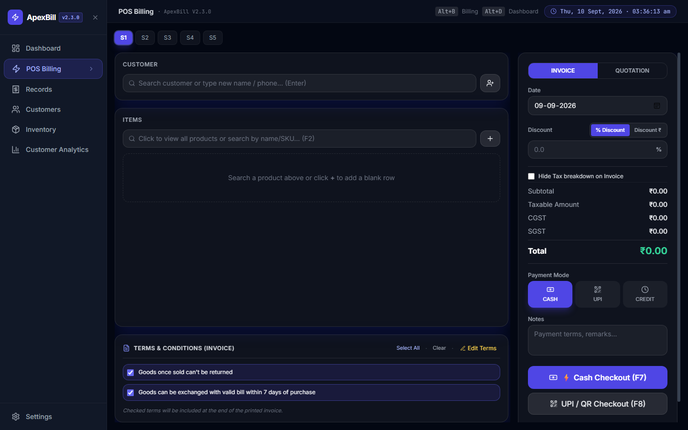
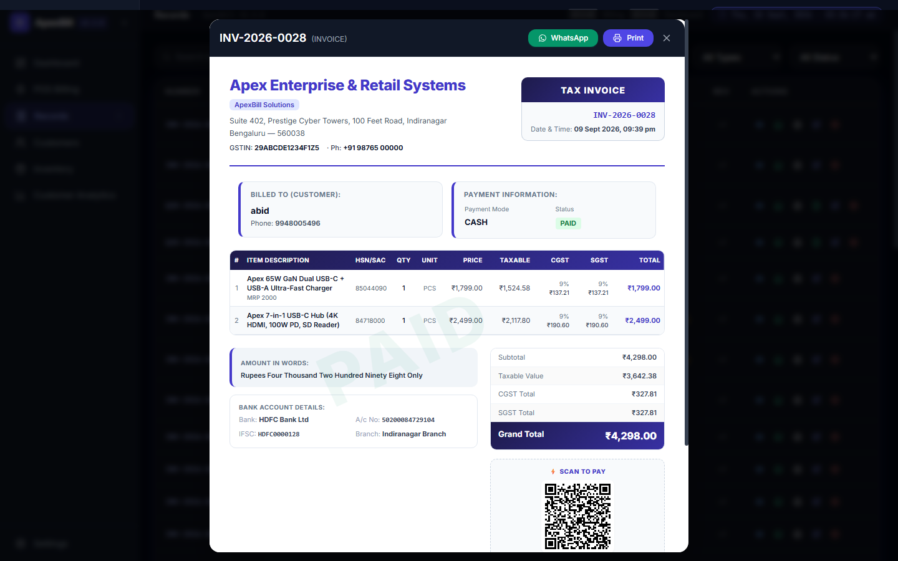
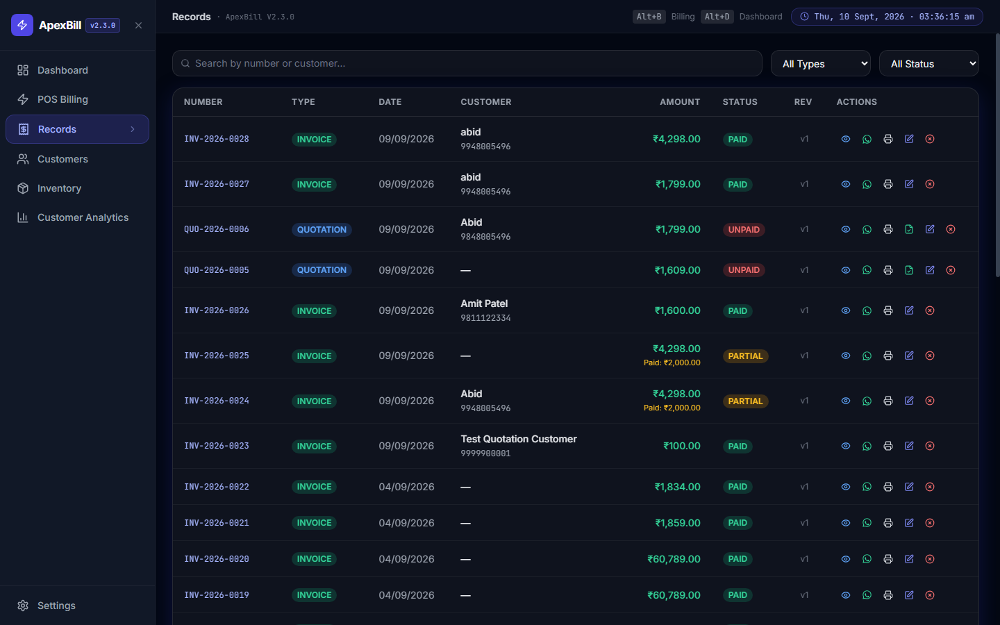
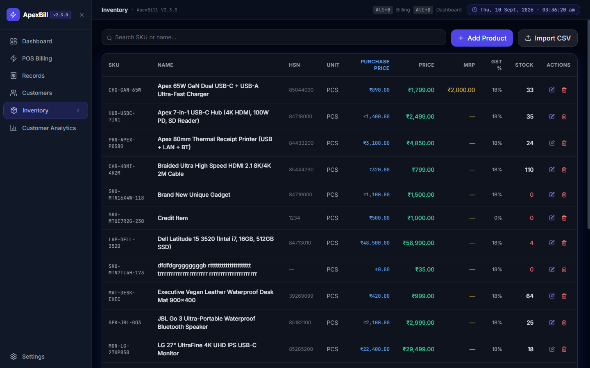
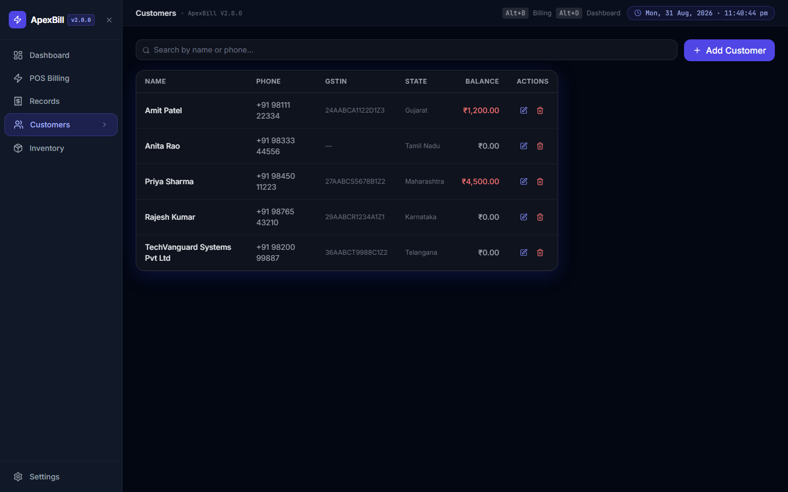
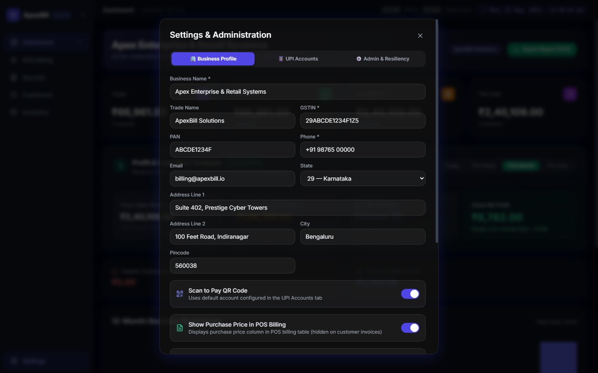

# ApexBill — Modern Billing, POS & Inventory Management System

<p align="center">
  
</p>

<p align="center">
  <strong>An offline-first, high-performance billing, POS, and sales intelligence platform built for modern retail, wholesale, and service businesses.</strong>
</p>

<p align="center">
  
  
  
  
  
  
</p>

---

## 🌟 Key Capabilities & Features

### ⚡ 1. Ultra-Fast POS Billing Workspace
- **5 Concurrent Memory Slots (`Alt+1..5`)**: Switch and hold multiple customer carts simultaneously without data loss or UI slowdown.
- **High-Speed Keyboard Navigation**: Complete entire billing workflows using keyboard hotkeys (`F2` search, `F4` quotation, `F7` cash, `F8` UPI QR).
- **Live SKU & Barcode Search**: Instant product lookup with keyboard arrow navigation and quick auto-fill.
- **Purchase Price & Margin Protection**: Optional inline purchase price display with real-time alert highlighting if selling price falls below cost.
- **Stock-Limit Safeguards**: Proactive stock quantity checking with an executive confirmation dialog to either cap or bypass limits.
- **Live Estimated Bill Profit**: See live taxable margin and gross profit for every bill before finalizing.
- **Quick Product Modal (`Alt+N`)**: Add brand-new inventory items directly from the checkout table without leaving the POS screen.

### 📊 2. Executive Sales & PnL Analytics Dashboard
- **Real-Time Revenue Metrics**: Instant KPI summary cards for *Today*, *This Week*, *This Month*, and *This Year*.
- **Profit & Loss (PnL) Engine**: Automatic breakdown of *Gross Revenue*, *Cost of Goods Sold (COGS)*, *GST Tax Liability*, and *Gross Net Profit* with dynamic margin percentage.
- **12-Month Sales Trend Breakdown**: Interactive monthly sales chart to track seasonal trends and business growth.
- **Customer Spend Drill-down**: Click on metrics to inspect ranked customer spending breakdowns.
- **CSV Sales Report Export**: 1-click export of financial reports for accounting and audit compliance.

### 🧾 3. Executive Invoice & Thermal Receipt Layouts
- **Modern Executive A4 GST Tax Invoice**: Clean typography, structured seller/buyer info, itemized HSN table, CGST/SGST split, bank details, authorized signatory, and UPI QR code.
- **80mm ESC/POS Thermal Receipts**: Streamlined thermal layout for retail counters and high-traffic POS environments.
- **Quotation / Estimate Support (`F4`)**: Issue professional quotes with validity notes and convert them to tax invoices in a single click.

### 📱 4. Dynamic NPCI UPI QR Engine
- **Instant Scan-to-Pay**: Generates standard NPCI-compliant UPI deep links (`upi://pay?pa=...&pn=...&am=...&tn=...`) rendered on screen and printed invoices.
- **Multi-UPI Accounts Manager**: Configure multiple merchant handles (e.g., HDFC, ICICI, SBI) and set active default accounts.
- **Instant QR Verification**: Works with PhonePe, Google Pay, Paytm, BHIM, and all banking UPI apps.

### 🔄 5. Records Management & Atomic Stock Reconciler
- **Unified Register**: Search and filter past invoices and quotations by type, date range, customer, or payment status.
- **Atomic Stock Restoration**: Editing a historical invoice automatically restocks old items, validates new stock levels, recalculates tax totals, and increments revision numbers (`v1` → `v2`).
- **1-Click Quotation Conversion**: Convert any quotation directly into an active invoice without retyping line items.
- **Invoice Cancellation**: Void invoices with automatic inventory replenishment.

### 📦 6. Inventory & SKU Management
- **Multi-Unit Product Catalog**: Support for `PCS`, `KG`, `LTR`, `MTR`, `BOX`, `PKT`, `NOS`, `SET`, `PAIR`, `DOZ`, and custom units.
- **Stock Health Indicators**: Visual status tags for *In Stock*, *Low Stock*, and *Out of Stock*.
- **High-Speed CSV Bulk Importer**: Upload 2,000+ SKUs with pricing, HSN codes, and initial stock quantities in under 1.5 seconds.

### 👥 7. Customer Directory & Ledger
- **Phone-Number-Indexed Master**: Fast lookup by customer phone number, name, or GSTIN.
- **Outstanding Balance Tracker**: Monitor customer credit, pending dues, and payment history.
- **Inline Customer Registration**: Typing a new customer phone and name during billing automatically saves them to the master database.

### ⚙️ 8. Administration & Data Resiliency
- **Business Profile**: Configure Company Name, Trade Name, GSTIN, PAN, Phone, Email, Address, and Bank Account Details.
- **POS Feature Toggles**: Control visibility of purchase prices, profit margins, and stock limit constraints.
- **1-Click JSON Backup & Restore**: Export full database snapshots for offsite archival and restore seamlessly.

---

## 📸 Application Screenshots

### 1. Sales Performance & PnL Analytics Dashboard
Monitor daily turnover, gross revenue, cost of goods, GST liability, and net profit margins in real time.


---

### 2. POS Billing Workspace (5-Slot Multi-Cart)
High-speed checkout with 5 hold slots, live SKU search, purchase price protection, customer auto-complete, and instant GST calculation.


---

### 3. Executive A4 GST Invoice & Quotation Preview
Clean, high-impact A4 tax invoice template featuring itemized GST breakdown, bank payment info, and dynamic NPCI QR code.


---

### 4. Records & Document History
Filter and manage historical invoices, track revision numbers, void transactions, or convert quotations to tax invoices.


---

### 5. Inventory & Multi-Unit Catalog
Track stock quantities, HSN/SAC codes, profit margins, and tax rates with batch CSV import/export support.


---

### 6. Customer Master & Credit Directory
Search customer records, track outstanding balances, and view transaction histories.


---

### 7. Seller Profile, Multi-UPI & Admin Settings
Manage business details, banking info, multi-UPI QR accounts, POS display toggles, and data backup/restore.


---

## ⌨️ Keyboard Shortcuts

| Shortcut | Action | Scope |
|:---|:---|:---|
| <kbd>F2</kbd> | Focus Item Search / SKU Barcode Input | POS Billing |
| <kbd>F4</kbd> | Save Document as Quotation / Estimate | POS Billing |
| <kbd>F7</kbd> | Quick Cash Checkout & Finalize | POS Billing |
| <kbd>F8</kbd> | Quick UPI / QR Checkout & Print | POS Billing |
| <kbd>Alt</kbd> + <kbd>N</kbd> | Open Quick Product Creation Modal | POS Billing |
| <kbd>Alt</kbd> + <kbd>1</kbd> .. <kbd>5</kbd> | Switch POS Hold Carts (Memory Slots 1–5) | Global |
| <kbd>Alt</kbd> + <kbd>B</kbd> | Navigate to POS Billing Workspace | Global |
| <kbd>Alt</kbd> + <kbd>D</kbd> | Navigate to Sales Dashboard | Global |
| <kbd>Esc</kbd> | Close Modals & Dropdown Popups | Global |

---

## 🚀 Quick Start Guide

### Option A: 1-Click Standalone Portable (Windows — Zero Install)

ApexBill provides a standalone portable package bundled with an embedded Node.js runtime and SQLite engine:

1. Download or extract the release archive (`ApexBill-v2.1.0-Portable.zip`).
2. Double-click **`Launch-ApexBill.vbs`** (or **`ApexBill.bat`**).
3. ApexBill launches immediately in a dedicated desktop application window at `http://localhost:54321`.

> **Zero Dependencies**: Requires no pre-installed software, database server, or administrative privileges.

---

### Option B: Developer Setup (From Source)

#### Prerequisites
- **Node.js 20+** or **Node.js 22+** (supports built-in `node:sqlite`)
- **npm** or **pnpm** / **yarn**

#### 1. Clone & Install Dependencies
```powershell
# Clone the repository
git clone https://github.com/mdwaleedibrahim/ApexBilling.git
cd ApexBilling

# Install Server dependencies
cd src/server
npm install

# Install Client dependencies
cd ../client
npm install
cd ../..
```

#### 2. Run in Development Mode
```powershell
# Quick launcher via PowerShell:
powershell -ExecutionPolicy Bypass -File ./scripts/dev.ps1

# Or run via npm root commands:
npm run dev

# Or run frontend and backend individually:
# Terminal 1 (Fastify Server on port 54321):
cd src/server && npm run dev

# Terminal 2 (Vite Client on port 5173):
cd src/client && npm run dev
```
Open **`http://localhost:5173`** for live-reloading client development, or **`http://localhost:54321`** for unified API & static bundle.

#### 3. Production Build
```powershell
# Fast build batch launcher:
scripts\build.bat

# Or via npm root command:
npm run build

# Start production server (serves both API & Frontend):
npm start
# Open http://localhost:54321
```

#### 4. Package Portable Windows Release
```powershell
# Generates a self-contained ZIP bundle in /release:
powershell -ExecutionPolicy Bypass -File ./scripts/release.ps1
# or: npm run package
```

---

## 📑 CSV Bulk Inventory Import Format

Upload products in bulk via **Inventory → Import CSV**:

```csv
sku,name,hsn_sac,unit,purchase_price,selling_price,tax_rate,stock_qty
LAP-DELL-3520,Dell Latitude 15 3520 Laptop,84713010,PCS,48500,58990,18,12
MON-LG-27UP850,LG 27 Inch 4K UHD Monitor,85285200,PCS,22400,29499,18,18
KB-LOGI-MXMECH,Logitech MX Mechanical Keyboard,84716060,PCS,8200,11495,18,32
ROL-THERM-80X50,80mm Thermal Paper Rolls Pack of 10,48119000,BOX,380,650,12,150
```

- **Supported Units**: `PCS`, `KG`, `GM`, `LTR`, `ML`, `MTR`, `BOX`, `PKT`, `NOS`, `SET`, `PAIR`, `DOZ`, `ROLL`, `BAG`, `CTN`.
- **Conflict Handling**: Existing SKUs are automatically updated (UPSERT) with adjusted quantities and prices.

---

## 🗄️ Database & Storage Architecture

ApexBill uses an embedded SQLite database engine with **Write-Ahead Logging (WAL)** enabled for instant queries, concurrent reads, and zero corruption risk.

- **Primary Database File**:
  ```
  %APPDATA%\ApexBill\billing_app.db
  ```
- **Concurrency & Lock Safeguards**: Configured with `PRAGMA busy_timeout = 5000` to prevent `SQLITE_BUSY` errors during concurrent transactions.
- **Dedicated Analytical Indexes**:
  - `idx_documents_customer_phone` for instant customer purchase histories.
  - `idx_documents_analytics` (`doc_type, doc_date, payment_status`) for real-time dashboard analytics.
- **Automatic Migrations**: Database tables, indexes, and columns are migrated on startup without data loss.
- **Atomic Transactions**: Multi-table operations (billing, stock reconciliation, and customer updates) execute inside isolated transactions.

---

## 🛠️ Technology Stack

| Layer | Technology | Purpose |
|:---|:---|:---|
| **Frontend UI** | React 18, Vite, TypeScript | Modern reactive interface with fast HMR |
| **Styling** | Tailwind CSS | Executive dark-mode design system & print styles |
| **State Management** | Zustand | Multi-cart memory slots & live invoice calculations |
| **Backend API** | Fastify (TypeScript) | High-throughput REST backend on port `54321` |
| **Database** | SQLite (`node:sqlite` / WAL mode) | Fast, embedded, zero-configuration persistence |
| **QR Engine** | `qrcode.react` | NPCI-compliant dynamic UPI payment QR codes |
| **Icons & UI** | Lucide React | Clean, modern iconography |
| **Packaging** | PowerShell, VBScript, Batch | 1-click standalone portable Windows distribution |

---

## 📁 Repository Structure

```
ApexBill/
├── src/
│   ├── client/                 # React + Vite frontend application
│   │   ├── src/
│   │   │   ├── components/     # Modular UI views
│   │   │   │   ├── billing/    # POS workspace, cart items, customer selector
│   │   │   │   ├── dashboard/  # Sales metrics, PnL analytics, trend charts
│   │   │   │   ├── history/    # Invoice register & quotation conversion
│   │   │   │   ├── inventory/  # Product catalog, stock alerts, CSV modal
│   │   │   │   ├── customers/  # Customer directory & outstanding balances
│   │   │   │   ├── settings/   # Business profile, multi-UPI, data backup
│   │   │   │   └── print/      # A4 GST Tax Invoice & 80mm ESC/POS templates
│   │   │   ├── store/          # Zustand stores (billing, slots, dialogs)
│   │   │   └── utils/          # GST calculation engine & UPI generator
│   │   └── package.json
│   └── server/                 # Fastify backend server
│       ├── src/
│       │   ├── db/             # SQLite connection, migrations, schema.sql
│       │   ├── routes/         # REST API endpoints (billing, inventory, etc.)
│       │   └── services/       # GST math, stock reconciler, CSV importer
│       ├── public/             # Compiled frontend assets for unified hosting
│       └── package.json
├── scripts/                    # Build, dev, release packaging and utility scripts
│   ├── build.bat               # Fast build batch launcher
│   ├── build.ps1               # Automated frontend & backend build script
│   ├── dev.ps1                 # Local dev server session orchestrator
│   ├── release.ps1             # 1-click release packager shortcut
│   ├── package-release.ps1     # 1-click portable release builder
│   ├── seed-sample-data.js     # Demo & sample data seeder
│   ├── start-service.vbs       # Silent background service launcher
│   ├── bump-version.js         # Automated changelog & versioning
│   ├── capture-screenshots.js  # Screenshot generator
│   └── stop-server.js          # Process termination helper
├── docs/screenshots/           # Documentation screenshot gallery
└── package.json                # Root workflow commands
```

---

## 📄 License & Attribution

Built with ❤️ by [Waleed Ibrahim](https://github.com/mdwaleedibrahim).  
Licensed under the [MIT License](LICENSE).
